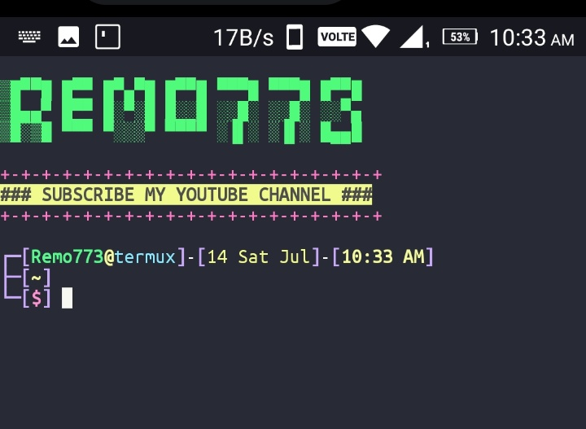

# Termux-Style
#ProHunter

## This script contains popular features

- [x] oh-my-zsh themes
- [x] zsh-autosuggest-command plugins
- [x] zsh-syntax-highlighting plugins
- [x] termux-banner
- [x] PS1 with custom trim path indicator
- [x] Custom prompt cursor
- [ ] other (git prompt)

Setup Termux Style By ph

0. `apt update && apt full-upgrade`

1. `apt install git python -y`

2. `git clone https://github.com/hackstore/Termux-Style`

3. `cd Termux-Style/`

4. `ls`

5. `bash t-header.sh`

Can You Use ProHunter Terminal

6. `chmod +x prohunter`

7. `./prohunter`

Can You Remove The Style

8. `bash t-header.sh --remove && exit`

Can Yoy Rename Your Terminal And Banner

9. `python rename.py`

after complete all processing just --open new session-- or `source ~/.zshrc`
edit style nano ~/.zshrc 
font and color cd ~/.termux

